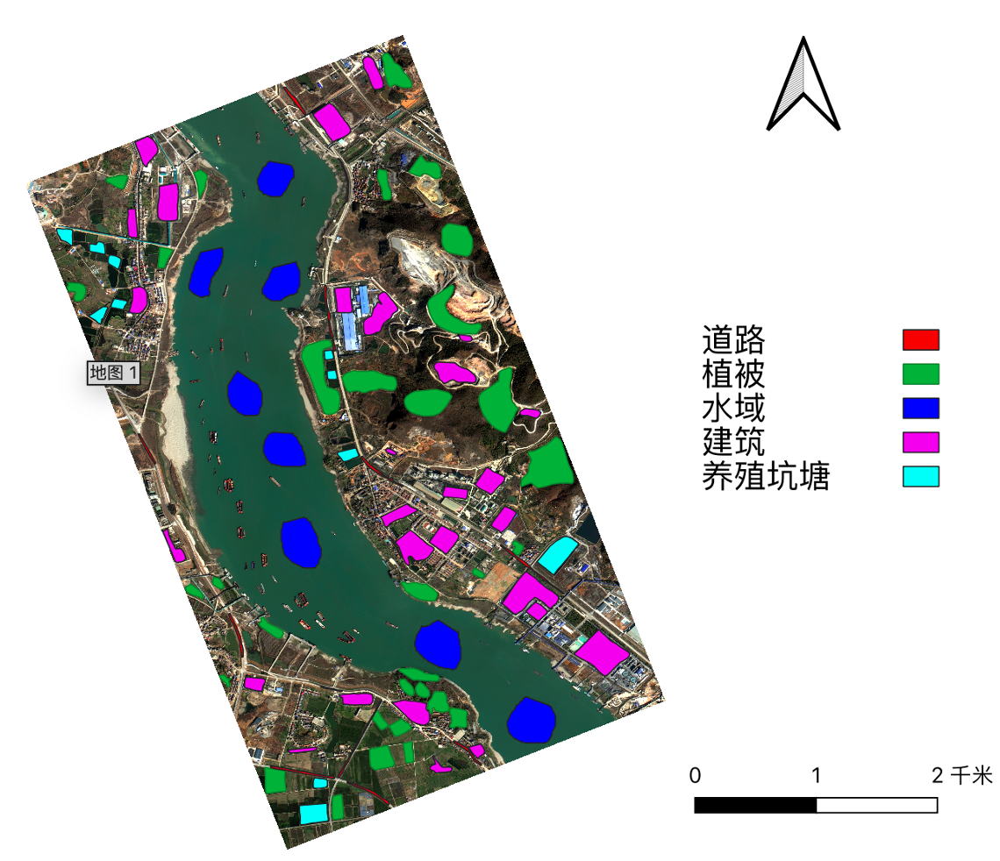
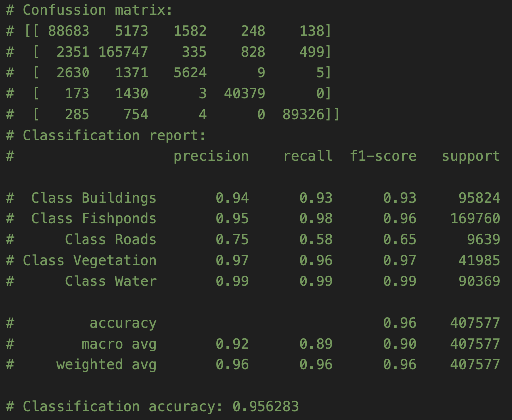
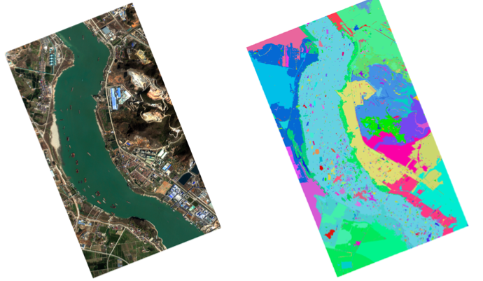
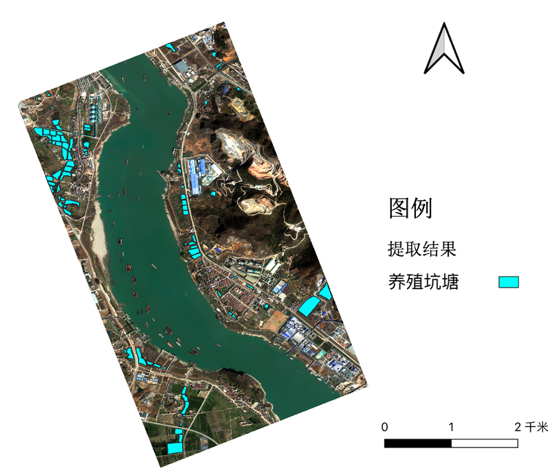

# 从卫星影像到土地覆盖分类/特定地物提取模型构建全流程讲解


## 1.训练样本集制作
在ArcMap（或其他类似软件）中制作训练样本集:
新建文件夹traindata,在traindata文件夹上右键“新建”->“Shapefile(S)”，新建shapefile图层，表示一类地物。新建图层为“面”状图层，坐标系与基础影像一致。

<figure style="text-align: center;">
  
  <figcaption>训练样本集</figcaption>
</figure>

**训练样本集制作要求**：
>（1）不同影像上构建样本，需注明哪些shp对应哪张影像  
（2）训练样区的位置要尽可能均匀分布整个影像，不能只集中在某个地方选择   
（3）每种样本需要覆盖所有该类地物情况，比如不同颜色的水体等

## 2.构建训练样本集

**get_training_data(\*args)**
根据步骤1制作的训练样本矢量数据对各类地物样本进行标记(labeled_pixels：已标记的训练样本)，同时对对应位置处用get_labels函数进行标记(is_train：训练样本处标记值，1表示该处为训练样本，0表示该处为非训练样本)，并记录分类类别(classes)及对应的标记值，在程序控制台中输出。

```python
def get_training_data(*args):
    if len(args)==3:
        rows,cols,n_bands,geo_transform,proj,bands_data=read_tif_path(args[1],args[2])
    else:
        rows,cols,n_bands,geo_transform,proj,bands_data=read_tif_multiband(args[1])
    
    bands_data[bands_data==65535]=0
    bands_data[np.isnan(bands_data)]=0
    bands_data[bands_data<0]=0

    bands_data = bands_data[:,:,[0,1,2,3]] # b,g,r,nir 
    # 计算NDVI
    # Ndvi=get_ndvi(bands_data[:,:,4],bands_data[:,:,3])
    Ndvi=get_ndvi(bands_data[:,:,3],bands_data[:,:,2])
    # # 计算纹理特征
    # Contrast,Homogenity,Energy,Correlation=func_glcmfeature.get_imgfeature(data)
    # bands_data=np.dstack([bands_data,Ndvi,Contrast,Homogenity,Energy,Correlation])
    bands_data=np.dstack([bands_data,Ndvi])
    # print(bands_data.shape)
    n_bands=bands_data.shape[2]
    # del Contrast,Homogenity,Energy,Correlation
    # 标准化
    bands_data=normalize(bands_data)
    #
    labeled_pixels,is_train,classes=get_labels(args[0],rows,cols,geo_transform,proj)
    training_labels=labeled_pixels[is_train] # 返回数组a中所有非零元素
    training_samples=bands_data[is_train]
    return rows,cols,n_bands,geo_transform,proj,bands_data,training_labels,training_samples,classes

def get_labels(vector_path,rows,cols,geo_transform,proj):
    files=[f for f in os.listdir(vector_path) if f.endswith('.shp')]
    classes=[f.split('.')[0] for f in files]
    shapefiles=[os.path.join(vector_path,f) for f in files]

    labeled_pixels=vectors_to_raster(shapefiles,rows,cols,geo_transform,proj)
    is_train=np.nonzero(labeled_pixels) #返回数组a中非零元素的索引值数组，结果为包含2个array的tuple，第一array为行数，第二array为列数
    ## 统计各样本像元数占总数比例
    tmp=labeled_pixels[is_train] # 返回数组a中所有非零元素
    nums_sum = len(tmp)
    for i,classe in enumerate(shapefiles):
        idx = tmp==i+1
        print(classe+' : %.4f'%(np.sum(idx)/float(nums_sum)*100)+'%')
    #
    del tmp
    return labeled_pixels,is_train,classes
```


## 3.分类模型构建 
**train_data(training_samples, training_labels, is_train_split)**
- training_samples:训练样本特征值
- training_labels：训练样本标签值
- is_train_split：是否对输入训练数据集进行划分。True表示进行划分,分为训练集与测试集两部分,默认训练集90%,测试集10%。False表示不进行划分，所有输入数据作为训练集。

```python
def train_data(training_samples, training_labels, is_train_split):
    # 分类器01-随机森林
    classifier=RandomForestClassifier(n_estimators=300,n_jobs=-1)
    # 分类器02-SVM
    # classifier=svm.SVC(C=1.0, kernel='rbf', gamma=2)
    print('model training...')
    if is_train_split:
    # 训练数据
        # 对训练集划分,默认90%训练,10%验证
        x_train, x_test, y_train, y_test = train_test_split(training_samples, training_labels, train_size=0.9,test_size=0.1)
        # 训练模型
        classifier.fit(x_train,y_train)
        # 保存分类器
        print('model saving...')
        joblib.dump(classifier,"./Classifiermodel.m")
        return classifier,x_test,y_test
    else:
        classifier.fit(training_samples,training_labels)
        # 保存分类器
        print('model saving...')
        joblib.dump(classifier,"./Classifiermodel.m")
        return classifier
```

## 4.模型测试数据精度评价
**valid_data(\*args)** 函数既可用于无验证集模型精度评价，也可用于有验证集模型精度评价。

```python
def valid_data(*args): 
    print('model validdtion...')
    if len(args)==4:            # classifier,x_test,y_test,classes
        # 无测试集精度评价
        print('model accuracy assessment:')
        verification_labels=args[2]
        predicted_labels=args[0].predict(args[1])
        accuracy_asses(predicted_labels,verification_labels,args[3])
    else:                       # validation_data_path,bands_data,rows,cols,geo_transform,proj,classifier
        # 有测试精度评价
        verification_pixels,is_verfication,classes=get_labels(args[0],args[2],args[3],args[4],args[5])
        verification_labels=verification_pixels[is_verfication]
        bands_data=args[1]
        validation_samples=bands_data[is_verfication]
        predicted_labels=args[6].predict(validation_samples)
        accuracy_asses(predicted_labels,verification_labels,classes)
        del bands_data

def accuracy_asses(predicted_labels,verification_labels,classes):
    print("Confussion matrix:\n%s" %
      metrics.confusion_matrix(verification_labels, predicted_labels))
    target_names = ['Class %s' % s for s in classes]
    print("Classification report:\n%s" %
        metrics.classification_report(verification_labels, predicted_labels,
                                        target_names=target_names))
    print("Classification accuracy: %f" %
        metrics.accuracy_score(verification_labels, predicted_labels))
```
无验证集时，可设置is_train_split为True，直接对输入训练样本数据集进行9:1划分，将10%训练样本数据集进行，然后进行精度评价
```python
# # 验证分类精度
# 测试数据
valid_data(classifier,x_test,y_test,classes)
```
有验证集时(制作方式与步骤1.1一致，新建validdata文件夹，在该文件夹下分别新建各类地物的shapefile，**注意其覆盖位置与traindata文件夹中不能一致**)，直接基于验证样本数据集进行精度评价。
```python
# 验证数据
valid_data(validation_data_path,bands_data,rows,cols,geo_transform,proj,classifier)
```

<figure style="text-align: center;">
  
  <figcaption>混淆矩阵输出示例</figcaption>
</figure>

## 5.分类模型保存
在1.3步骤中,默认将训练完成的模型保存成Classifiermodel.m,后续可在本地加载该模型并应用于其他影像。
```python
# 分类器本地加载
classifier=joblib.load("./Classifiermodel.m")
```
## 6.分类模型应用
**classify(classifier,rows,cols,n_bands,geo_transform,proj,bands_data)**
该函数为应用分类模型到tif图像中，运行速度由图像大小决定。
```python
def classify(classifier,rows,cols,n_bands,geo_transform,proj,bands_data):
    n_samples=rows*cols
    flat_pixels=bands_data.reshape((n_samples,n_bands))

    result=[]
    print('classifying...')
    for i in np.arange(0,flat_pixels.shape[0],100000):
        if i<flat_pixels.shape[0]-100000:
            tmp=flat_pixels[i:i+100000,:]
            res=classifier.predict(tmp)
        else:
            tmp=flat_pixels[i:,:]
            res=classifier.predict(tmp)
        result.append(res)
        del tmp,res
        # print(i,'-',i+100000,' Done.')
    result=np.hstack(result)
    classfication=result.reshape((rows,cols))
    return classfication
```

## 7.分类结果后处理
**classPostProcess(classfication,array_s,geo_transform,proj,saveraster,savevector)**
主要作用是对分类模型输出分类结果进行后处理，如：各类地物小斑块联通等，函数返回最终分类结果,包括栅格和矢量格式，可视情况注释其中句子以缩短程序执行时间。

<figure style="text-align: center;">
  
  <figcaption>真彩色高分影像（左）和多尺度分割结果（右）</figcaption>
</figure>


```python
def img_morphology(img,kernelsize):
    kernel = np.ones((kernelsize, kernelsize), np.uint8)
    closed = cv2.morphologyEx(img,cv2.MORPH_CLOSE,kernel)
    return closed

def imgSegmentation(bands_data,scale,geo_transform,proj,savename='segmentation.tif'):
    # 分割
    print('Segmentation Starting...')
    img = img_as_float(bands_data[:, :, 0:3])
    img = exposure.rescale_intensity(img)
    segments_fz = felzenszwalb(img, scale=scale, sigma=0.001, min_size=200)
    print(f"Felzenszwalb number of segments: {len(np.unique(segments_fz))}")
    # 保存分割结果
    driver=gdal.GetDriverByName("GTiff")
    rows,cols=segments_fz.shape
    dataset=driver.Create('./results/'+savename,cols,rows,1,gdal.GDT_Float32)
    dataset.SetGeoTransform(geo_transform)
    dataset.SetProjection(proj)
    band=dataset.GetRasterBand(1)
    band.WriteArray(segments_fz)
    dataset=None # 关闭文件
    print("Segmentation Finished!")

    return segments_fz

def classPostProcess(classfication,array_s,geo_transform,proj,saveraster,savevector):
    # 开运算
    array_c = img_morphology(classfication,3)
    # 对分类结果应用分割结果
    print('Applying segmentation on classification result...')
    idx = array_c ==0
    res_seg_classify = np.zeros_like(array_c)
    nums = np.unique(array_s)
    for i,num in enumerate(nums):
        idx_num = array_s == num
        array_c_in_idx = array_c[idx_num]
        # 'float64'转'int64',似乎np.bincount()需要输入是int64
        array_c_in_idx = array_c_in_idx.astype('int64') 
        counts = np.bincount(array_c_in_idx)
        res_seg_classify[idx_num] = np.argmax(counts)
    # 保存栅格分类结果
    write_geotiff(saveraster,res_seg_classify,geo_transform,proj)
    # 保存矢量分类结果
    raster=array2raster(res_seg_classify,geo_transform,proj, \
        res_seg_classify.shape[1],res_seg_classify.shape[0])
    raster2vector_esrishp(raster,savevector)
    print('Classification Finished!')
```
## 8.模型参数设置

### 图像分割
**imgSegmentation(bands_data,scale,geo_transform,proj)** 中调用的felzenszwalb函数。官方参考：https://scikit-image.org/docs/stable/api/skimage.segmentation.html#skimage.segmentation.felzenszwalb 

`felzenszwalb`函数用于计算Felsenszwalb的基于有效图的图像分割。所有参数如下：
```python
skimage.segmentation.felzenszwalb(image, scale=1, sigma=0.8, min_size=20, multichannel=True)
```

- image:ndarray，输入图像，(宽度,高度,3)或者(宽度,高度)
- **scale**：float，设置观察级别，值越大意味着分割得到的斑块越小。
- sigma：float，高斯核直径，用于在分割之前平滑图像
- min_size:int，最小斑块的大小，在分割完成后用于后处理，若斑块小于min_size则会合并
- multichannel:bool，可选（默认值True），图像的最后一个轴是否被解释为多个通道。对于3D图像，False的值目前不支持。

分割的斑块数量及其规模只能通过scale间接控制。根据局部对比度不同，图像中的分段大小可能会有很大差异。RGB图像是基于颜色空间中像素之间的欧氏距离进行分割。

函数返回：segment_mask,（宽度，高度），ndarray整数数组，每一个斑块一个值。

应用示例：
```python
from skimage.segmentation import felzenszwalb
from skimage.data import coffee
img = coffee()
segments = felzenszwalb(img, scale=3.0, sigma=0.95, min_size=5)
```

### 随机森林
**train_data(training_samples, training_labels, is_train_split)** 中调用的RandomForestClassifier函数。官方参考：https://scikit-learn.org/stable/modules/generated/sklearn.ensemble.RandomForestClassifier.html

所有参数如下：
```python
sklearn.ensemble.RandomForestClassifier(n_estimators=100, *,
 criterion='gini', max_depth=None, min_samples_split=2, 
 min_samples_leaf=1, min_weight_fraction_leaf=0.0, 
 max_features='auto', max_leaf_nodes=None, 
 min_impurity_decrease=0.0, min_impurity_split=None, 
 bootstrap=True, oob_score=False, n_jobs=None, 
 random_state=None, verbose=0, warm_start=False, 
 class_weight=None, ccp_alpha=0.0, max_samples=None)
```

函数解释参考：https://blog.csdn.net/w952470866/article/details/78987265/

部分解释如下：
- **n_estimators**: 
int，随机森林中树的棵树，默认为100.
    >The number of trees in the forest.
    

- max_features:
寻找最佳分割时需要考虑的特征数目：
    - int，就要考虑每一次分割处的max_feature特征
    - float，那么max_features就是一个百分比，那么（max_feature*n_features）特征整数值是在每个分割处考虑的。
    - auto，那么max_features=sqrt(n_features)，即n_features的平方根值。
    - log2，那么max_features=log2(n_features)
    - None,那么max_features=n_features

    注意：寻找分割点不会停止，直到找到最少一个有效的节点划分区，即使它需要有效检查超过max_features的特征。

    >The number of features to consider when looking for the best split:
    >- If int, then consider max_features features at each split.
    >- If float, then max_features is a fraction and round(max_features * n_features) features are considered at each split.
    >- If “auto”, then max_features=sqrt(n_features).
    >- If “sqrt”, then max_features=sqrt(n_features) (same as “auto”).
    >- If “log2”, then max_features=log2(n_features).
    >- If None, then max_features=n_features.

    >Note: the search for a split does not stop until at least one valid partition of the node samples is found, even if it requires to effectively inspect more than max_features features.

- max_depth: 
整数或None，默认None。（决策）树的最大深度。如果值为None，那么会扩展节点，直到所有的叶子是纯净的，或者直到所有叶子包含少于min_sample_split的样本。
    >The maximum depth of the tree. If None, then nodes are expanded until all leaves are pure or until all leaves contain less than min_samples_split samples.

- min_samples_split：
整数或浮点数，默认取2。分割内部节点所需要的最小样本数量。如果为int，那么考虑min_samples_split作为最小的数字。如果为float，那么min_samples_split是一个百分比，并且把ceil(min_samples_split*n_samples)是每一个分割最小的样本数量。
    >The minimum number of samples required to be at a leaf node. A split point at any depth will only be considered if it leaves at least min_samples_leaf training samples in each of the left and right branches. This may have the effect of smoothing the model, especially in regression.
    >- If int, then consider min_samples_leaf as the minimum number.
    >- If float, then min_samples_leaf is a fraction and ceil(min_samples_leaf * n_samples) are the minimum number of samples for each node.


- n_jobs:
int,用于并行运算的工作数。-1表示把处理器所有核用于运算。主要用于设置运算速度。
    
    > The number of jobs to run in parallel. fit, predict, decision_path and apply are all parallelized over the trees. None means 1 unless in a joblib.parallel_backend context. -1 means using all processors. See Glossary for more details.

## 9.主函数

```python
if __name__=="__main__":
    ###########Lst-8###########
    os.chdir(r'/Users/Database')
    raster_data_path = "./rawdata/Extract_tiff21.tif"
    os.makedirs('./results/features',exist_ok=True)
    output_fname_raster = "./results/classification.tif"
    output_fname_vector = "./results/classification.shp"
    train_data_path = "./traindata"

    starttime=datetime.datetime.now()
    # inputbands=['1','2','3','4']
    # rows,cols,n_bands,geo_transform,proj,bands_data, \
    #     training_labels,training_samples,classes=get_training_data(train_data_path,raster_data_path,inputbands)
    rows,cols,n_bands,geo_transform,proj,bands_data, \
    training_labels,training_samples,classes=get_training_data(train_data_path,raster_data_path)

    # # 分割
    _,_,_,_,array_s = read_tif('./results/segmentation.tif')
    # array_s= imgSegmentation(bands_data,300,geo_transform,proj)

    # 训练分类器
    classifier=train_data(training_samples, training_labels,False)
    classifier,x_test,y_test=train_data(training_samples, training_labels,True)
    
    # # # 验证分类精度
    # # 测试数据
    # valid_data(classifier,x_test,y_test,classes)
    # # # 验证数据
    # # valid_data(validation_data_path,bands_data,rows,cols,geo_transform,proj,classifier)

    # # # 分类器本地加载
    classifier=joblib.load("./Classifiermodel.m")
    # 土地利用分类
    bands_data[np.isnan(bands_data)]=0
    classfication=classify(classifier,rows,cols,n_bands,geo_transform,proj,bands_data)

    # # 分类结果后处理与保存
    classPostProcess(classfication,array_s,geo_transform,proj,output_fname_raster,output_fname_vector)
    ## 添加类别属性列
    addfieeld(output_fname_vector,classes)

    endtime=datetime.datetime.now()
    spendtime=(endtime-starttime).total_seconds()
    print(spendtime,' s used in all',', with '+str(rows)+'*'+str(cols)+' image size')
```

<figure style="text-align: center;">
  
  <figcaption>养殖坑塘提取结果</figcaption>
</figure>

## 10.数据和代码下载

示例卫星影像数据下载：
https://drive.google.com/drive/folders/1NMEk4OvC0thgMalS7dUkTlL54rH1JJwa?usp=sharing
完整代码下载：
https://github.com/zhaohuilifr/SF_LULC_eg
